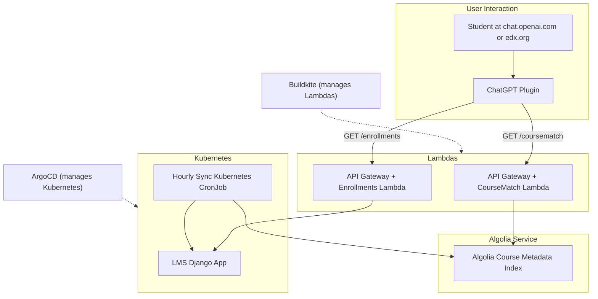

# 📚 AI-Powered Course Recommendation Architecture

This project demonstrates a modern, LLM-backed course recommendation system, inspired by work at edX in 2023. It is designed as a portfolio and learning resource for deploying and extending AI-powered services.

> **Related:** [edX Debuts Two AI-Powered Learning Assistants Built on ChatGPT](https://press.edx.org/edx-debuts-two-ai-powered-learning-assistants-built-on-chatgpt)

## 🏗️ Architecture Overview

The system integrates:
- **ChatGPT Plugin (OpenAPI Spec):** For student interaction
- **AWS Lambda APIs:** Real-time course recommendations (Algolia-backed) and enrollment data (Postgres-backed)
- **Kubernetes CronJob:** Syncs course metadata to Algolia hourly
- **LMS Backend:** Stores student enrollment history in Postgres
- **Algolia Index:** Vector search for course metadata

### 📈 V1 Architecture Diagram



## 🏗️ V2 Architecture Diagram (Future/Planned)

> _This section is a placeholder for a future architecture diagram and description. Potential improvements may include direct LLM integration (e.g., AWS Bedrock), tighter LMS coupling, or new orchestration patterns._

## 🗂️ Key Components

| Component                | Description                                      |
|-------------------------|--------------------------------------------------|
| `openapi.yaml`          | OpenAPI spec for ChatGPT plugin endpoints        |
| `coursematch-lambda/`| Lambda for course matching (Algolia, takes keywords)      |
| `enrollment-lambda/`    | Lambda for enrollment data (Postgres)            |
| `infrastructure/`       | Terraform for AWS infra, cdk8s for CronJob       |
| `coursematch_algolia_sample.json`   | Example Algolia index data                       |
| `sample_data.sql`       | Example Postgres data (learners, courses, enrollments) |

## 🗝️ Key Decisions

- **Serverless Python APIs:** We chose to deploy Python APIs to AWS Lambda rather than building a new Django service. This reduces lead time for new features, simplifies deployment, and leverages serverless scalability without managing additional infrastructure.
- **Algolia for Search:** We use Algolia for course metadata indexing and search. This reduces both latency for end users and operational strain on the central LMS database, enabling fast, scalable recommendations and filtering.

## 🛠️ How It Works
1. Student opens ChatGPT with the plugin installed or loads the Xpert chat box on edx.org.
2. Plugin calls `GET /coursematch?keywords=<>`.
3. Lambda fetches student’s course history from Postgres and queries Algolia for related courses.
4. Lambda returns ranked matches with explanations.
5. CronJob updates Algolia hourly with the latest course catalog and metadata from the LMS.

## 🚀 Deployment Instructions

### Prerequisites
- AWS CLI & credentials
- Terraform
- Python 3.9+
- Docker (for Lambda packaging)
- kubectl & cdk8s (for K8s CronJob)
- Algolia account (optional, can run without)

### 1. Infrastructure
- `cd infrastructure`
- `terraform init && terraform apply`
- Note EKS cluster and Lambda ARNs in outputs

### 2. Deploy Lambdas
- `cd coursematch-lambda && ./deploy.sh`
- `cd enrollment-lambda && ./deploy.sh`

### 3. Set Up Postgres
- Deploy Postgres (RDS or local)
- Run `sample_data.sql` to load learners/courses
- Use `sqlalchemy_models.py` for schema

### 4. Algolia Index
- (Optional) Create Algolia index, load `coursematch_algolia_sample.json`
- If not using Algolia, Lambda will return mock data

### 5. Kubernetes CronJob
- `cd infrastructure`
- Deploy with cdk8s: `cdk8s synth && kubectl apply -f dist/`

### 6. Test the Plugin
- Use the OpenAPI spec (`openapi.yaml`) to register the plugin with ChatGPT
- Try `GET /recommendations?student_id=1`

## 💡 Why This Architecture?
- **Composable:** Reuses existing LMS APIs
- **Real-time:** Student context queried on demand
- **Searchable:** Uses Algolia for vector similarity + filtering
- **AI-Ready:** Interacts with GPT via spec-compliant plugin

## 🧪 Sample Data
- See `enrollment-lambda/sample_data.sql` for learners/courses
- See `coursematch-lambda/coursematch_algolia_sample.json` for Algolia index

## 🧪 Running Tests

Each Lambda includes simple tests using pytest.

### 1. Set Up Python Environment (Recommended)

We recommend using [pyenv](https://github.com/pyenv/pyenv) to manage Python versions and `venv` for isolated environments.

#### Install pyenv (if not already installed)
```sh
brew install pyenv  # macOS
# or see https://github.com/pyenv/pyenv#installation for other OS
```